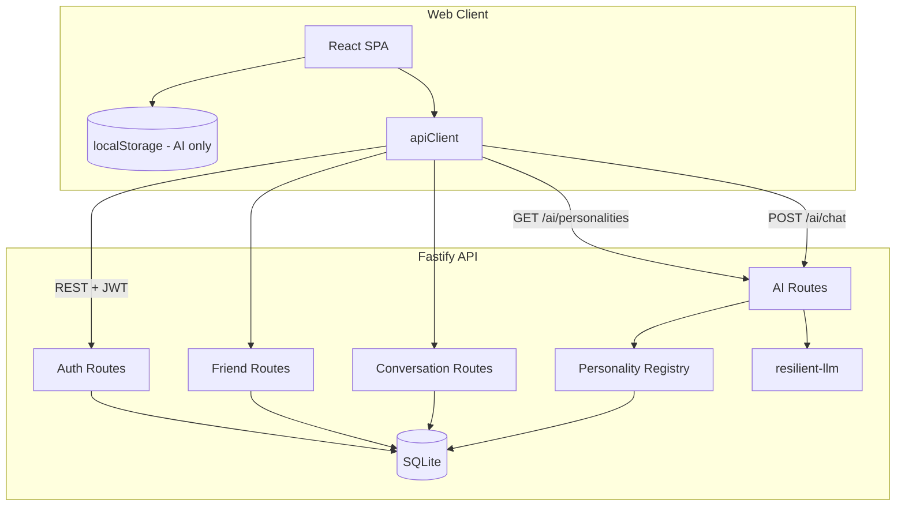
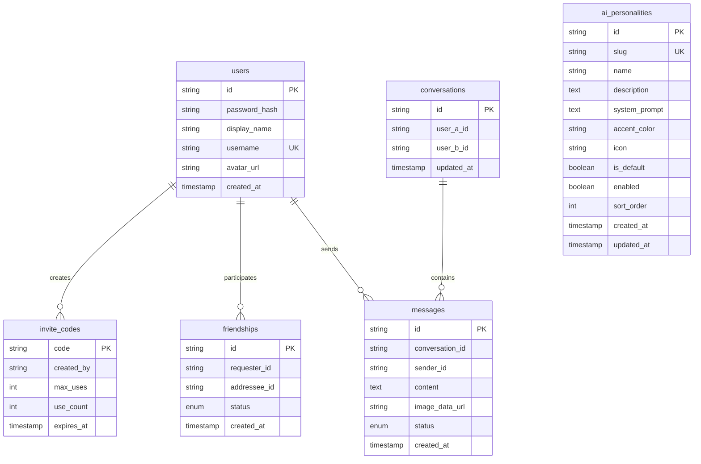
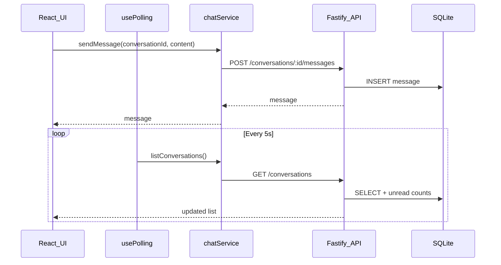
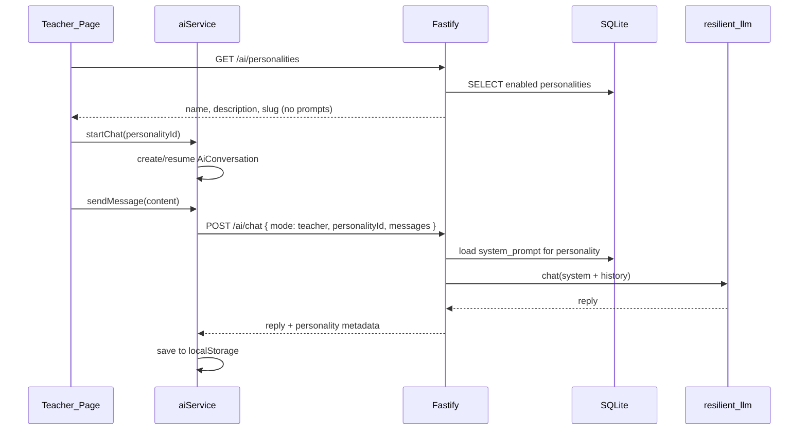

# Technical Design: School Friends Chat + AI (v1)

Based on [REQUIREMENTS.md](REQUIREMENTS.md). **Implemented** - monorepo with React frontend, Fastify API, and SQLite persistence.

## Decisions locked in

| Topic | Choice |
|-------|--------|
| Platform | Web only (mobile-responsive SPA) |
| Persistence | **SQLite** on server (`better-sqlite3`) for users, friends, messages; **localStorage** for AI history only |
| Registration | Invite code required; username is primary identity (no email) |
| Authentication | JWT bearer tokens; bcrypt password hashing |
| Messaging scope | 1:1 only (no groups) |
| Real-time updates | HTTP polling (~5 s), not WebSockets |
| AI integration | [resilient-llm](https://github.com/gitcommitshow/resilient-llm) via Fastify API proxy (keys stay server-side) |
| Visual design | Neon theme (dark + glowing accents); WhatsApp-familiar layout patterns |
| Cross-device sync | REST API + shared SQLite database |
| Deployment | Single VPS - Fastify serves API and optionally static web build |
| Teacher AI personalities | SQLite `ai_personalities` table; prompts resolved server-side only |

---

## Architecture



**Pattern:** The React SPA calls a **Fastify REST API** for auth, friends, and messaging. All shared data lives in SQLite on the server so two users on different computers see the same messages. AI conversation history stays client-side in `localStorage` and is sent to the AI proxy per request.

**Why this stack**

- **React + Vite** - fast dev, mobile-friendly UI
- **SQLite + Fastify** - minimal infra, no separate DB server, good for a small friend group on one VPS
- **HTTP polling** - simplest cross-device sync without WebSocket infrastructure
- **Thin AI proxy** - resilient-llm stays server-side; client sends mode + recent history in the request body

---

## Repository layout

```
an-intro-session-2/
├── REQUIREMENTS.md
├── TECHNICAL_DESIGN.md
├── README.md
├── package.json                 # npm workspaces root
├── apps/
│   ├── web/                     # React + Vite frontend
│   │   └── src/
│   │       ├── api/client.ts    # HTTP client with JWT
│   │       ├── services/        # auth, friend, chat, ai
│   │       ├── storage/         # localStorage (AI history only)
│   │       ├── hooks/           # useAuth, usePolling, useConversations
│   │       ├── pages/           # Login, Register, Chats, Chat, Friends, AI, Settings
│   │       └── components/      # ChatBubble, ConversationList, BottomNav, etc.
│   └── api/                     # Fastify REST API + AI proxy
│       └── src/
│           ├── db/index.ts      # SQLite schema + data access
│           ├── routes/          # auth, friends, conversations, invites, ai, ai-personalities
│           ├── services/        # auth, friend, chat, ai, personalityService
│           └── middleware/auth.ts
└── packages/
    └── shared/                  # shared TypeScript types
```

---

## Data model

### Server (SQLite)



### Client (localStorage - AI only)

| Key | Type | Contents |
|-----|------|----------|
| `schoolchat:ai_conversations` | array | AI thread list (includes `personalityId` for teacher threads) |
| `schoolchat:ai_messages` | object | `{ [aiConversationId]: AiMessage[] }` |
| `schoolchat:session` | object | Cached session `{ userId, username, displayName }` + JWT token |

**Extended client field - `AiConversation`:**

```typescript
interface AiConversation {
  id: string;
  userId: string;
  title: string;
  mode: 'teacher' | 'chat';
  personalityId?: string;   // teacher mode only; omitted = default general tutor
  createdAt: string;
}
```

**Key constraints**

- **conversations:** unique pair `(user_a_id, user_b_id)` with IDs stored in sorted order
- **friendships:** status ∈ `pending | accepted | blocked`
- **messages:** `content` OR `image_data_url` required; images stored as base64 (~2 MB limit)
- **users:** `username` unique, normalized lowercase, 3–20 chars, `[a-z0-9_]`
- **invite_codes:** validated at register; `use_count` incremented on success; default seed `SCHOOL01`
- **ai_personalities:** `slug` unique; exactly one row with `is_default = true` for teacher mode; `system_prompt` never returned in public API responses

### Seed personalities (server bootstrap)

On first run, seed named AI Twin teachers (each mirrors a real Sir's coaching style):

| slug | name | expertise labels |
|------|------|------------------|
| `general` | Pradeep Sir | AI, Startups |
| `math` | Praveen Sir | Math, Puzzles |
| `coding` | Surya Sir | Coding, Software |
| `thinking` | Mayank Sir | Decision Making, Judgement |

Each label is one or two words. Stored as JSON in `expertise_labels`; returned as `expertiseLabels: string[]` on `GET /ai/personalities`.

Display names omit prefixes; the web app renders a tiny **AI Twin** badge after each name and multiple **expertise** pills (accent-colored, distinct from the AI Twin tag).

Admins can add, disable, reorder, or edit prompts via admin API or direct DB updates.

---

## REST API

All routes prefixed with `/api`. Authenticated routes require `Authorization: Bearer <jwt>`.

### Auth

| Method | Path | Description |
|--------|------|-------------|
| POST | `/auth/register` | `{ inviteCode, username, password, displayName }` |
| POST | `/auth/login` | `{ username, password }` |
| GET | `/auth/me` | Current user profile |
| PATCH | `/auth/me` | Update `{ displayName?, avatarUrl? }` |

### Invites

| Method | Path | Description |
|--------|------|-------------|
| POST | `/invites` | Generate new invite code |
| GET | `/invites/mine` | List codes created by current user |

### Friends

| Method | Path | Description |
|--------|------|-------------|
| GET | `/friends` | List accepted friends |
| GET | `/friends/requests` | Incoming + outgoing pending requests |
| POST | `/friends/request` | `{ username }` - send friend request |
| POST | `/friends/requests/:id/accept` | Accept request |
| POST | `/friends/requests/:id/decline` | Decline request |
| DELETE | `/friends/:userId` | Unfriend |
| POST | `/friends/:userId/block` | Block user |

### Conversations & messages

| Method | Path | Description |
|--------|------|-------------|
| GET | `/conversations` | List with last message + unread count |
| POST | `/conversations` | `{ friendUserId }` - get or create 1:1 thread |
| GET | `/conversations/:id/messages` | Message history |
| POST | `/conversations/:id/messages` | Send `{ content?, imageDataUrl? }` |
| POST | `/conversations/:id/read` | Mark conversation read |

### AI

| Method | Path | Description |
|--------|------|-------------|
| GET | `/ai/personalities` | List enabled teacher personalities (metadata only - no system prompts) |
| POST | `/ai/chat` | `{ mode, personalityId?, messages[] }` → `{ reply, personality? }` |

### AI personalities (admin - deferred)

Admin REST API is not implemented in v1. Personalities are managed via SQLite seed data in `apps/api/src/db/index.ts`.

**Public personality response shape** (client-safe):

```json
{
  "id": "uuid",
  "slug": "math",
  "name": "Praveen Sir",
  "description": "Step-by-step help with algebra, geometry, and more.",
  "accentColor": "#00f5ff",
  "icon": "calculator",
  "isDefault": false,
  "sortOrder": 2
}
```

---

## Client-side services

| Module | Path | Responsibility |
|--------|------|----------------|
| `apiClient` | `apps/web/src/api/client.ts` | HTTP requests, JWT header, error handling |
| `authService` | `apps/web/src/services/authService.ts` | Register, login, logout, profile, invites |
| `friendService` | `apps/web/src/services/friendService.ts` | Requests, accept/decline, block, unfriend |
| `chatService` | `apps/web/src/services/chatService.ts` | Conversations, send message, read state |
| `aiService` | `apps/web/src/services/aiService.ts` | AI threads, personalities fetch, call AI proxy, persist to localStorage |
| `storageService` | `apps/web/src/storage/storageService.ts` | localStorage read/write (AI history) |
| `personalityService` | `apps/api/src/services/personalityService.ts` | Load/CRUD personalities; resolve system prompt by id/slug |

### Shared types (`packages/shared`)

```typescript
/** Public tutor metadata - safe to send to the browser. */
export interface AiPersonality {
  id: string;
  slug: string;
  name: string;
  description: string;
  accentColor?: string;
  icon?: string;
  isDefault: boolean;
  sortOrder: number;
}

/** Admin-only create/update payload includes systemPrompt. */
export interface AiPersonalityInput {
  slug: string;
  name: string;
  description: string;
  systemPrompt: string;
  accentColor?: string;
  icon?: string;
  enabled?: boolean;
  sortOrder?: number;
}
```

### Auth flow

1. User registers with invite code + username + password
2. Server validates invite, hashes password (bcrypt), saves user, returns JWT
3. Client stores JWT + session; sends `Authorization` header on subsequent requests
4. Login matches username + password hash → JWT

**Bootstrap:** Server seeds default invite code `SCHOOL01` on first run.

### Messaging flow



**Unread counts:** Server computes messages after `last_read_at` from the other user. Opening a chat calls `POST /conversations/:id/read`.

---

## AI proxy

**Endpoint:** `POST /api/ai/chat`

**Request body:**

```json
{
  "mode": "teacher",
  "personalityId": "math",
  "messages": [
    { "role": "user", "content": "Explain quadratic equations" }
  ]
}
```

- `personalityId` - optional for `teacher` mode; slug or id of a server personality. If omitted, server uses the default general tutor.
- `personalityId` - ignored for `chat` mode (casual companion uses a fixed prompt).

**Response:**

```json
{
  "reply": { "role": "assistant", "content": "..." },
  "personality": { "id": "...", "name": "[AI Twin] Praveen Sir", "slug": "math" }
}
```

**Location:** `apps/api/src/services/aiService.ts` - wraps resilient-llm. Prompt resolution in `apps/api/src/services/personalityService.ts`.

**Client flow**

1. Teacher page loads → `GET /api/ai/personalities` → render personality cards
2. Student picks a personality → client creates or resumes an `AiConversation` with `personalityId`
3. User sends message → `aiService` saves to `localStorage`
4. `aiService` POSTs `mode`, `personalityId`, and last 20 messages to `/api/ai/chat`
5. Server loads personality from SQLite, prepends `system_prompt`, calls `llm.chat()`, returns reply
6. `aiService` saves assistant message to `localStorage`



**Modes**

- **Teacher** - Teacher tab shows personality picker; each thread bound to one personality (or default)
- **Chat** - single pinned casual thread on Chats list; fixed system prompt, no personalities

**System prompts**

- **Default general tutor** - friendly tutor for students aged 14–18; explain clearly, offer quizzes, stay safe (current learn prompt)
- **Specialized personalities** - custom `system_prompt` per row in `ai_personalities`; edited on server without redeploying the web app
- **Chat (casual)** - fun, age-appropriate companion; not personality-based

**Prompt security**

- `system_prompt` is stored only in SQLite and used inside `personalityService` / `aiService`
- Public and authenticated student routes never include prompt text in responses
- Client sends `personalityId` only; server resolves the prompt

**Safety**

- LLM API keys server-side only
- Static disclaimer banner in AI UI
- All personalities inherit a base safety clause appended server-side (harmful content refusal, age-appropriate tone)
- No separate content moderation layer beyond prompts

---

## Auth & security

| Concern | Approach |
|---------|----------|
| Passwords | bcrypt hash in SQLite |
| Sessions | JWT (configurable secret via `JWT_SECRET`) |
| Invite codes | Validated server-side; use count tracked |
| CORS | Restricted to `WEB_ORIGIN` |
| Images | Client-side size/type validation; base64 in SQLite |
| HTTPS | Required in production (reverse proxy) |
| AI keys | Never exposed to client |
| Personality prompts | Server-only; never returned in API responses |
| Admin personality API | Deferred - edit SQLite seed for v1 |

---

## Visual design (Neon theme)

Dark-first UI with vivid neon accents, soft glows, and high contrast. Layout patterns follow familiar chat-app conventions (list → thread, bottom nav, search, FAB) with neon styling.

### Design tokens

Defined in `apps/web/src/styles/theme.css`:

| Token | Usage |
|-------|-------|
| `--neon-cyan` | Primary actions, sent messages, active nav, friend chat |
| `--neon-magenta` | AI section accent, Teacher mode, unread badges |
| `--neon-green` | Online/success states |
| `--neon-purple` | Chat mode accent |
| `--glow-cyan` / `--glow-magenta` | Buttons, focus rings, badges |

### AI vs friend chat distinction

| Area | Friend chat | AI chat |
|------|-------------|---------|
| Accent color | `--neon-cyan` | `--neon-magenta` |
| Header badge | - | "AI" pill with magenta glow |
| Banner | - | "You are chatting with AI - not a real person" |
| Teacher mode | - | Magenta accent; personality picker + per-tutor threads |
| Chat mode | - | Purple accent; pinned on Chats list |

### Layout

- **Full-width** chat homepage (`chat-home`) - same width as chat detail page
- **Bottom nav** spans full viewport width
- **Font:** Space Grotesk

---

## Frontend structure

```
apps/web/src/
├── styles/
│   ├── theme.css
│   └── global.css
├── api/
│   └── client.ts
├── storage/
│   └── storageService.ts      # AI history only
├── services/
│   ├── authService.ts
│   ├── friendService.ts
│   ├── chatService.ts
│   └── aiService.ts
├── pages/
│   ├── LoginPage.tsx
│   ├── RegisterPage.tsx
│   ├── ChatsPage.tsx          # full-width; pinned AI + onboarding
│   ├── ChatPage.tsx
│   ├── AIPage.tsx             # Teacher personality picker + recent sessions
│   ├── AIChatPage.tsx
│   ├── FriendsPage.tsx
│   └── SettingsPage.tsx
├── components/
│   ├── ChatBubble.tsx
│   ├── ConversationList.tsx
│   ├── MessageInput.tsx
│   ├── AIChatPanel.tsx
│   ├── PersonalityCard.tsx    # teacher tutor tile
│   ├── BottomNav.tsx
│   ├── NeonButton.tsx
│   ├── ScreenHeader.tsx
│   ├── SearchBar.tsx
│   ├── NewChatFab.tsx
│   ├── OnboardingEmptyState.tsx
│   └── PinnedAiChatRow.tsx
└── hooks/
    ├── useAuth.tsx
    ├── useConversations.ts
    ├── usePolling.ts
    └── useLocalStorage.ts
```

---

## Deployment

| Component | Service |
|-----------|---------|
| API + web (production) | Single VPS - Fastify with `SERVE_STATIC=true` |
| Database | SQLite file at `DATABASE_PATH` |
| Process manager | pm2 |
| HTTPS | Caddy or nginx reverse proxy |
| Backup | Regular copy of SQLite file |

See [README.md](README.md) for env vars and setup steps.

---

## Environment variables

```env
# apps/api/.env
LLM_PRIMARY_PROVIDER=openai
LLM_FALLBACK_PROVIDERS=anthropic,gemini
LLM_MODEL=gpt-4o-mini
OPENAI_API_KEY=
ANTHROPIC_API_KEY=

PORT=3001
WEB_ORIGIN=http://localhost:5173
JWT_SECRET=change-me-in-production
DATABASE_PATH=./data/schoolchat.db

# Production: serve built web app from the same process
SERVE_STATIC=false
WEB_DIST_PATH=../web/dist

# Admin API for managing AI personalities (optional)
ADMIN_SECRET=change-me-in-production
```

Vite dev server proxies `/api` to the API on port 3001.

---

## Implementation status

| Phase | Status |
|-------|--------|
| Scaffold - Vite + React, shared types, neon theme | ✅ Done |
| SQLite schema + seed invite code | ✅ Done |
| JWT auth + register/login/me + invite generation | ✅ Done |
| Friends - requests, accept/decline, block (API) | ✅ Done |
| 1:1 chat - conversations, messages, read state, unread | ✅ Done |
| Images - base64 encode, size validation, preview | ✅ Done |
| AI proxy - Fastify route + resilient-llm | ✅ Done |
| AI chat UI - Teacher/Chat modes, localStorage history | ✅ Done |
| Teacher personalities - server registry + picker UI | ✅ Done |
| Cross-device sync - REST + polling | ✅ Done |
| Username-based auth (no email) | ✅ Done |
| Onboarding empty state | ✅ Done |
| Full-width neon chat layout | ✅ Done |
| VPS deployment docs | ✅ Done |
| Avatar upload UI | Not implemented |
| Unfriend/block UI | Not implemented (API ready) |
| Push notifications | Out of scope |

---

## Testing strategy

Integration tests in `apps/api/src/app.test.ts` (Vitest, in-memory SQLite):

1. **Happy path:** Register with invite → add friend → send message → see in thread
2. **Edge case:** Register with invalid invite code → error
3. **Edge case:** Blocked user cannot send message → error
4. **Edge case (planned):** Unknown or disabled `personalityId` on `/ai/chat` → 400 with fallback hint
5. **Happy path (planned):** List personalities → start math tutor chat → server uses math system prompt

---

## Out of scope for v1

- WebSockets / true real-time push
- Group chats, voice/video, push notifications
- End-to-end encryption
- Message edit/delete, search, typing indicators
- Native mobile apps
- Cloud image storage (CDN/S3)
- AI history sync to server

## Future enhancements

- WebSocket or SSE for instant message delivery
- Avatar upload UI
- Unfriend/block actions in Friends UI
- Sync AI history to server per user
- PostgreSQL if user count grows beyond SQLite comfort zone
- Personality usage analytics (which tutors students use most)
- Per-personality model or temperature overrides (advanced admin fields)
