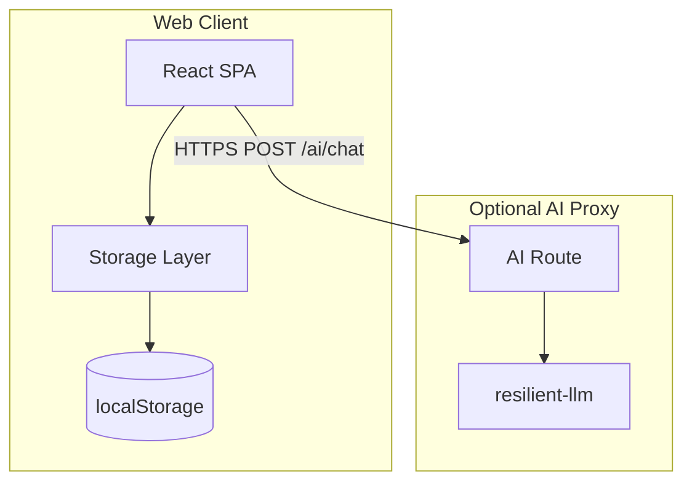
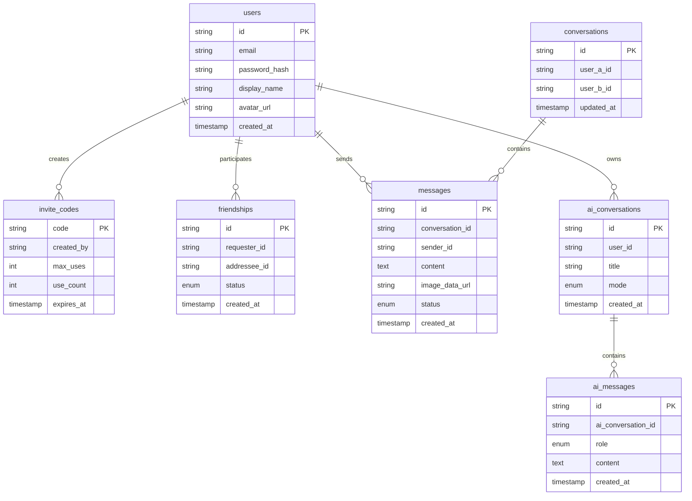
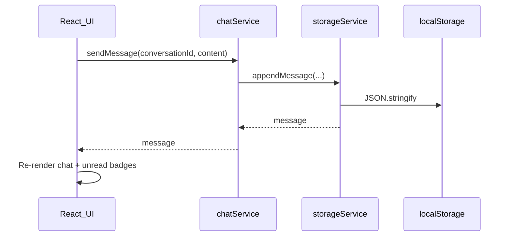

# Technical Design: School Friends Chat + AI (v1)

Based on [REQUIREMENTS.md](REQUIREMENTS.md). Greenfield project — no existing code.

## Decisions locked in

| Topic | Choice |
|-------|--------|
| Platform | Web only (mobile-responsive SPA) |
| Persistence | **Browser `localStorage`** — no database |
| Registration | Invite code required |
| Messaging scope | 1:1 only (no groups) |
| AI integration | [resilient-llm](https://github.com/gitcommitshow/resilient-llm) via a thin API proxy (keys stay server-side) |
| Visual design | Neon theme (dark + glowing accents) |
| Scale target | Single-browser prototype; ~10–50 users when a backend is added later |

---

## Architecture



**Pattern:** The app is a **client-only SPA** for auth, friends, messaging, and AI history. All data is read/written through a storage service that wraps `localStorage`. A **minimal backend** exists only to proxy AI requests so LLM API keys never ship to the browser.

**Why this stack**

- **React + Vite** — fast dev, mobile-friendly UI
- **localStorage** — zero infra, no database setup, good for v1 prototyping
- **Thin AI proxy** — resilient-llm stays server-side; client sends message + recent history in the request body

### v1 limitation (important)

Without a server database, **friend messages do not sync between devices or browsers**. Each installation holds its own data. Friend chat works as local 1:1 threads on that device. Cross-user real-time messaging is deferred until a backend is added.

For same-browser testing, the `storage` event can refresh UI when another tab writes to `localStorage`.

---

## Repository layout

```
an-intro-session-2/
├── REQUIREMENTS.md
├── TECHNICAL_DESIGN.md
├── package.json                 # npm workspaces root
├── apps/
│   ├── web/                     # React + Vite frontend (main app)
│   └── api/                     # Optional: thin Fastify AI proxy only
└── packages/
    └── shared/                  # shared TypeScript types
```

No `docker-compose.yml`, no Postgres, no object storage.

---

## Data model

Logical entities (stored as JSON in `localStorage`, not in a DB):



### Key constraints

- **conversations:** unique pair `(user_a_id, user_b_id)` with IDs stored in sorted order
- **friendships:** status ∈ `pending | accepted | blocked`
- **messages:** `content` OR `image_data_url` required
- **invite_codes:** validated locally at register; `use_count` incremented on success

---

## localStorage schema

All keys prefixed with `schoolchat:`.

| Key | Type | Contents |
|-----|------|----------|
| `schoolchat:session` | object | `{ userId, email, displayName }` — current logged-in user |
| `schoolchat:users` | array | All registered users on this browser |
| `schoolchat:invite_codes` | array | Valid invite codes |
| `schoolchat:friends` | array | Friendship records |
| `schoolchat:conversations` | array | 1:1 conversation metadata |
| `schoolchat:messages` | object | `{ [conversationId]: Message[] }` |
| `schoolchat:read_state` | object | `{ [conversationId]: lastReadAt }` |
| `schoolchat:ai_conversations` | array | AI thread list |
| `schoolchat:ai_messages` | object | `{ [aiConversationId]: AiMessage[] }` |

**Storage service:** `apps/web/src/storage/storageService.ts` — single module for get/set, JSON parse/stringify, and UUID generation.

```typescript
// Conceptual API
const storage = {
  getSession(): Session | null,
  setSession(session: Session | null): void,
  getUsers(): User[],
  saveUser(user: User): void,
  getMessages(conversationId: string): Message[],
  appendMessage(conversationId: string, message: Message): void,
  // ... etc.
};
```

### Images

Store images as **base64 data URLs** in `message.image_data_url`. No upload server.

- Max ~2 MB per image (keep under `localStorage` ~5 MB total limit per origin)
- Reject larger files with a user-visible error
- Prefer compressing client-side before save (optional v1 enhancement)

---

## Client-side services (no REST for app data)

All friend/auth/chat logic runs in the browser via service modules:

| Module | Path | Responsibility |
|--------|------|----------------|
| `authService` | `apps/web/src/services/authService.ts` | Register, login, logout, invite validation |
| `friendService` | `apps/web/src/services/friendService.ts` | Requests, accept/decline, block, unfriend |
| `chatService` | `apps/web/src/services/chatService.ts` | Conversations, send message, read state, unread counts |
| `aiService` | `apps/web/src/services/aiService.ts` | AI threads, call AI proxy, persist replies |
| `storageService` | `apps/web/src/storage/storageService.ts` | localStorage read/write |

### Auth & invites (local)

| Action | Behavior |
|--------|----------|
| Register | Validate invite code → hash password (Web Crypto or bcryptjs) → save user → set session |
| Login | Match email + password hash → set session |
| Logout | Clear `schoolchat:session` |
| Generate invite | Append new code to `schoolchat:invite_codes` |

**Bootstrap:** On first app load, if no invite codes exist, seed one default code (e.g. `SCHOOL01`) so the first user can register.

### Friends (local)

| Action | Behavior |
|--------|----------|
| Add friend | Lookup username in `schoolchat:users` → create pending friendship |
| Accept/decline | Update friendship status in `schoolchat:friends` |
| Block | Set status to `blocked` |

Friend discovery is limited to users registered **on the same browser** (same `localStorage`). For a multi-user demo, register two accounts in two tabs or use separate browser profiles.

### Messaging (local)

| Action | Behavior |
|--------|----------|
| List conversations | Read `schoolchat:conversations`, attach last message + unread count |
| Send message | Append to `schoolchat:messages[id]`, update conversation `updated_at` |
| Mark read | Update `schoolchat:read_state` |
| Unread count | Messages after `lastReadAt` from the other user |

No WebSockets. UI updates synchronously after write; listen to `window.storage` event for cross-tab refresh.



---

## AI proxy (minimal backend)

Only the AI path hits the server. No database on the server.

**Endpoint:** `POST /api/ai/chat`

**Request body:**

```json
{
  "mode": "learn",
  "messages": [
    { "role": "user", "content": "Explain photosynthesis" }
  ]
}
```

**Response:**

```json
{
  "reply": { "role": "assistant", "content": "..." }
}
```

**Location:** `apps/api/src/services/aiService.ts` — wraps resilient-llm.

```typescript
import { ResilientLLM } from 'resilient-llm';

const llm = new ResilientLLM({
  aiService: process.env.LLM_PRIMARY_PROVIDER,
  fallback: process.env.LLM_FALLBACK_PROVIDERS?.split(','),
  model: process.env.LLM_MODEL,
  retries: 3,
  rateLimitConfig: { requestsPerMinute: 30 },
});
```

**Client flow**

1. User sends message in AI chat
2. `aiService` saves user message to `localStorage`
3. `aiService` POSTs mode + last 20 messages to `/api/ai/chat`
4. Server prepends system prompt, calls `llm.chat()`, returns reply
5. `aiService` saves assistant message to `localStorage`

**System prompts**

- **Learn:** "You are a friendly tutor for students aged 14–18. Explain clearly, ask if they want a quiz, never produce harmful content. Say when unsure."
- **Chat:** "You are a fun, age-appropriate chat companion. Keep responses concise and safe for teens."

**Safety & limits**

- LLM API keys server-side only
- Server rate limit by IP (e.g. 20 requests/hour)
- Reject empty or oversized payloads (>4k chars)
- Static disclaimer in AI UI

---

## Auth & security

| Concern | Approach |
|---------|----------|
| Passwords | Hash with bcryptjs before storing in `localStorage` |
| Sessions | `schoolchat:session` key; cleared on logout |
| Invite codes | Validated from `schoolchat:invite_codes` |
| Data isolation | All data scoped to this browser origin |
| Images | Client-side size/type validation before base64 encode |
| HTTPS | Required in production |
| AI keys | Never exposed to client |

**Prototype caveats (document in app):**

- Data is lost if the user clears site data
- Passwords in `localStorage` are not production-grade security
- Friend chat does not sync across devices until a backend is added

---

## Visual design (Neon theme)

Dark-first UI with vivid neon accents, soft glows, and high contrast. Inspired by cyberpunk / synthwave aesthetics — energetic but readable for daily school chat.

### Design tokens

Define in `apps/web/src/styles/theme.css` as CSS custom properties:

| Token | Value | Usage |
|-------|-------|-------|
| `--bg-primary` | `#0a0a0f` | Page background |
| `--bg-surface` | `#12121a` | Cards, chat list rows, panels |
| `--bg-elevated` | `#1a1a26` | Input fields, modals |
| `--text-primary` | `#f0f0f5` | Body text |
| `--text-muted` | `#8888a0` | Timestamps, placeholders |
| `--neon-cyan` | `#00f5ff` | Primary actions, sent messages, active nav |
| `--neon-magenta` | `#ff00aa` | AI section accent, Learn mode |
| `--neon-green` | `#39ff14` | Online status, success states |
| `--neon-purple` | `#bf00ff` | Chat mode, secondary highlights |
| `--border-subtle` | `rgba(255, 255, 255, 0.08)` | Dividers |
| `--glow-cyan` | `0 0 12px rgba(0, 245, 255, 0.4)` | Buttons, focus rings |
| `--glow-magenta` | `0 0 12px rgba(255, 0, 170, 0.4)` | AI elements |

### Component styling

- **Background:** solid dark base; optional subtle radial gradient (deep purple → black) on auth screens
- **Chat bubbles:** own messages use `--neon-cyan` border + faint glow; received messages use `--bg-elevated` with subtle border
- **Buttons:** filled neon on dark, or outlined with glow on hover/focus
- **Bottom nav:** dark bar; active tab icon + label in `--neon-cyan` with glow
- **Unread badges:** small `--neon-magenta` pill with glow
- **Inputs:** dark fill, neon border on focus (`box-shadow: var(--glow-cyan)`)
- **Avatars:** circular with 2px neon ring

### AI vs friend chat distinction

| Area | Friend chat | AI chat |
|------|-------------|---------|
| Accent color | `--neon-cyan` | `--neon-magenta` |
| Header badge | — | "AI" pill with magenta glow |
| Banner | — | Magenta-tinted strip: "You are chatting with AI — not a real person" |
| Learn mode | — | Cyan accent |
| Chat mode | — | Purple accent |

### Typography & assets

- **Font:** `Inter` or `Space Grotesk` for UI; system fallback
- **Icons:** Lucide React — stroke icons pick up neon color on active states
- **Motion:** subtle 150–200ms transitions on hover/focus; no heavy animations (performance on mobile)

### Accessibility

- Maintain WCAG AA contrast for text on dark backgrounds
- Neon glow is decorative only — do not rely on color alone for status (pair with icons/labels)
- Respect `prefers-reduced-motion` (disable glow pulse animations)

---

## Frontend structure

```
apps/web/src/
├── styles/
│   ├── theme.css              # neon design tokens
│   └── global.css             # base styles, dark reset
├── storage/
│   └── storageService.ts      # localStorage wrapper
├── services/
│   ├── authService.ts
│   ├── friendService.ts
│   ├── chatService.ts
│   └── aiService.ts           # calls AI proxy, saves to localStorage
├── pages/
│   ├── LoginPage.tsx
│   ├── RegisterPage.tsx
│   ├── ChatsPage.tsx
│   ├── ChatPage.tsx
│   ├── AIPage.tsx
│   ├── AIChatPage.tsx
│   ├── FriendsPage.tsx
│   └── SettingsPage.tsx
├── components/
│   ├── ChatBubble.tsx
│   ├── ConversationList.tsx
│   ├── MessageInput.tsx
│   ├── AIChatPanel.tsx
│   ├── BottomNav.tsx
│   └── NeonButton.tsx
└── hooks/
    ├── useAuth.ts
    ├── useConversations.ts
    └── useLocalStorage.ts     # reactive sync with storage + storage events
```

**Unread counts**

- Computed from `read_state` vs message timestamps in `chatService`
- Updated immediately on send/receive (local write)
- Opening a chat calls `markAsRead`

---

## Deployment (v1)

| Component | Service |
|-----------|---------|
| Web | Static host (Vercel, Cloudflare Pages, GitHub Pages) |
| AI proxy | Optional small Node host (Railway, Fly.io) or local dev only |

No database, Redis, or object storage to provision.

---

## Environment variables

```
# AI proxy only (apps/api)
LLM_PRIMARY_PROVIDER=openai
LLM_FALLBACK_PROVIDERS=anthropic,gemini
LLM_MODEL=gpt-4o-mini
OPENAI_API_KEY=
ANTHROPIC_API_KEY=

# Web (apps/web)
VITE_AI_API_URL=http://localhost:3001/api
```

---

## Implementation order

1. **Scaffold** — Vite + React, shared types, neon theme tokens
2. **Storage layer** — `storageService` + localStorage schema
3. **Auth + invites** — register, login, logout, seed invite code
4. **Friends** — requests, accept/decline, block (local users)
5. **1:1 chat** — conversations, messages, read state, unread badges
6. **Images** — base64 encode, size validation, preview in chat
7. **AI proxy** — thin Fastify route + resilient-llm
8. **AI chat UI** — Learn/Chat modes, history in localStorage
9. **Polish** — mobile layout, storage event sync, data-loss notice in settings

---

## Testing strategy

1. **Happy path:** Register with invite → add friend (second local account) → send message → see it in thread and unread count
2. **Edge case:** Register with invalid/expired invite code → error shown
3. **Edge case:** Blocked user cannot send message → error shown

---

## Out of scope for v1

- Server database, WebSockets, cross-device sync
- Group chats, voice/video, push notifications
- End-to-end encryption
- Message edit/delete, search, typing indicators
- Native mobile apps
- Cloud image storage

## Future migration path

When ready for real multi-user chat, replace `storageService` calls with REST/WebSocket API calls and add PostgreSQL on the backend. The data model and UI structure stay largely the same.
